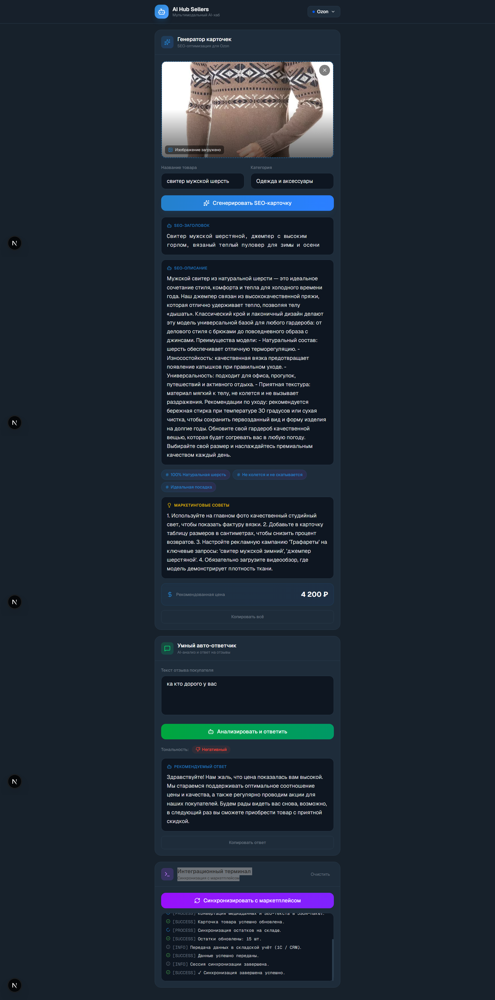

# 🤖 AI Hub Sellers — Multimodal Telegram Mini App (TMA)

Инновационное рабочее пространство для продавцов маркетплейсов (Wildberries / Ozon), разработанное в формате **Telegram Mini App**. Приложение объединяет в себе возможности мультимодального искусственного интеллекта (Google Gemini) для генерации и оптимизации контента, анализа отзывов и интеграции с API маркетплейсов.



---

## 🚀 Основной функционал

### ⚡ Генератор карточек товаров (SEO)
Полноценный модуль генерации SEO-контента через **Google Gemini**. Адаптируется под требования каждого маркетплейса:

| Особенность | Wildberries | Ozon |
|---|---|---|
| **SEO-заголовок** | до 60 символов, строгий минимализм | до 200 символов, формула Тип+Бренд+Особенности |
| **SEO-описание** | LSI-копирайтинг, ключи вплетаются в текст | Маркетинговый текст, упор на выгоды |
| **Триггеры** | Для инфографики на обложке | Для инфографики на обложке |
| **Цена** | В реалистичном диапазоне категории | В реалистичном диапазоне категории |

### 🧠 Умный автоответчик на отзывы
Анализ тональности отзыва (Positive / Negative / Neutral) через Gemini и генерация профессионального ответа от лица бренда.

### 💻 Интеграционный терминал
Сквозная синхронизация с API маркетплейсов:
- Без API-ключей — **демо-режим** с симуляцией шагов
- С API-ключами — **реальная интеграция**: валидация, обновление карточек, синхронизация остатков

---

## 🛠️ Технологический стек

- **Framework:** Next.js 16, Turbopack, TypeScript
- **UI:** Tailwind CSS 4, Framer Motion, Lucide React
- **AI:** Google Gemini 3.1 Flash Lite (через SOCKS5-прокси)
- **API интеграции:** Ozon Seller API, Wildberries Suppliers API

## 📦 Структура проекта

```
src/
├── app/
│   ├── layout.tsx              # Глобальная разметка, шрифты
│   ├── page.tsx                # Главный экран (композиция модулей)
│   └── api/
│       ├── generate-card/      # Генерация SEO-карточки через Gemini
│       ├── analyze-review/     # Анализ отзыва через Gemini
│       └── sync/               # Синхронизация с маркетплейсами
├── components/
│   ├── CardGenerator.tsx       # Модуль SEO-генерации
│   ├── SmartResponder.tsx      # Анализатор отзывов
│   ├── IntegrationTerminal.tsx # Терминал синхронизации
│   ├── Header.tsx              # Шапка с выбором маркетплейса
│   └── ImageUploader.tsx       # Загрузчик изображений
├── lib/
│   ├── gemini.ts               # Клиент Gemini API (с прокси)
│   └── marketplace.ts          # Интеграция с Ozon/WB API
├── types/
│   └── index.ts                # Типы и интерфейсы
└── data/
    └── mock.ts                 # Мок-данные (резерв)
```

## 🚀 Запуск проекта

```bash
# Установка зависимостей
npm install

# Запуск dev-сервера
npm run dev
```

Открой [http://localhost:3000](http://localhost:3000) в браузере.

## 🔧 Переменные окружения

Создайте `.env.local` в корне проекта:

```env
# Gemini AI (обязательно)
GEMINI_API_KEY=your_gemini_api_key
GEMINI_MODEL=gemini-2.0-flash-lite

# SOCKS5 прокси (если требуется)
PROXY_HOST=proxy_host
PROXY_PORT=proxy_port
PROXY_USER=proxy_user
PROXY_PASS=proxy_pass

# API маркетплейсов (опционально — для реальной интеграции)
OZON_CLIENT_ID=ozon_client_id
OZON_API_KEY=ozon_api_key
WB_API_KEY=wb_api_key
```

Без ключей маркетплейсов терминал работает в **демо-режиме**.
